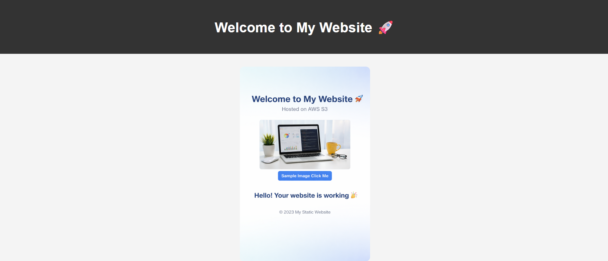
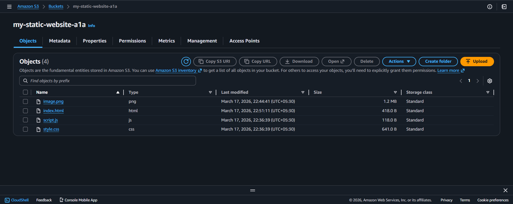

# 🌐 Static Website Hosting using AWS S3

## 📌 Project Overview
This project demonstrates how to host a static website using Amazon S3.  
The website is built using HTML, CSS, and JavaScript and deployed on AWS cloud.

---

## 🚀 Features
- Simple and responsive design  
- Hosted on AWS S3  
- Publicly accessible website  
- Static content (HTML, CSS, JS)

---

## 🛠️ Technologies Used
- HTML  
- CSS  
- JavaScript  
- AWS S3  

---

## 📂 Project Structure
/project
├── index.html
├── style.css
├── script.js
└── image.png

---

## ⚙️ Steps to Deploy
1. Create an S3 bucket  
2. Upload website files  
3. Enable static website hosting  
4. Set bucket policy for public access  
5. Access website using endpoint  

---

## 🌍 Live Website
Add your S3 URL here:
http://your-bucket-name.s3-website-region.amazonaws.com

## 📸 Screenshots

### 🌐 Website Output

### ☁️ S3 Bucket

## 👨‍💻 Author

Ajay Yadav
